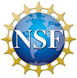

# Universal Dependencies Workshop 2023 (UDW 2023)

### [SyntaxFest 2023](https://syntaxfest.github.io/), Online, 21 to 25 March 2023.

UDW 2023 will be held at the SyntaxFest online (zoom and gather.town), during the week of
March 21-March 25, 2023.
The proceedings have been published preemptively, in December 2023.

[Universal Dependencies](http://universaldependencies.org/) (UD) is a
framework for cross-linguistically consistent treebank annotation that
has so far been applied to over 100 languages.

The framework is aiming to capture similarities as well as
idiosyncrasies among typologically different languages (e.g.,
morphologically rich languages, pro-drop languages, and languages
featuring clitic doubling). The goal in developing UD was not only to
support comparative evaluation and cross-lingual learning but also to
facilitate multilingual natural language processing and enable
comparative linguistic studies.

## Invited talk

Invited talk by [Emily Pitler](http://www.emilypitler.com/), Google: [Incorporating Compositionality and Morphology into End-to-End Models](/udw21/invited-talk)

### Sponsored by

